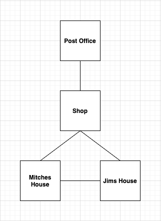

# FUN-OOP-MailBot

This sprint you will be using the Object Oriented Programming skills you have learned to create the components of a mail delivery simulation game.

## Day 1

In day 1 of this sprint you are expected to use the pseudo-classical pattern of object creation in order to create your building, village and robot objects. Remember to think about which properties and methods should belong to each of these different objects.

## Day 2

In day 2 of this sprint you should re-factor your code to make use of ES6 classes. Any code that uses the pseudo-classical pattern of object creation should be re-factored into classes.

Before we start it would be useful to know that the Village instance you will be creating is an implementation of a [graph](https://www.tutorialspoint.com/data_structures_algorithms/graph_data_structure.htm) data structure.
This can be thought of in a similar way to a village in that we have buildings(nodes/vertices) that are connected by roads(paths/edges)



Here there is a Post Office building connected to the Shop by a road which is connected to Both houses, which are connected to each other.

In this instance our Village(non-oop) would look something like this:

```js
const postOffice = { name: "Post Office" };
const shop = { name: "Shop" };
const jimsHouse = { name: "Jims House" };
const mitchesHouse = { name: "Mitches House" };

const village = {
  buildings: [shop, postOffice, jimsHouse, mitchesHouse],
  roads: [
    [jimsHouse, mitchesHouse],
    [jimsHouse, shop],
    [shop, mitchesHouse],
    [shop, postOffice],
  ],
};
```

### Building

- Each building should have an address and a mailbox property
- The buildings mailbox should be an array

### Village

- Each Village should have buildings and roads properties
- A Village should have an addBuilding method which takes a building and adds it to the village
- A Village should have an AddRoad method which takes 2 strings of building addresses and adds an array of the two buildings to its roads

```js
MyVillage.addRoad("Jims House", "Mitches House");
MyVillage.roads; // -----> [[{ address:'Jims House', mailbox:[]}, { address:'Mitches House', mailbox:[]}]]
```

- A Village should have a pathsFrom method that will return an array of addresses that are available from a given address

```js
MyVillage.pathsFrom("Jims House"); //-----> ['Shop', 'Mitches House']
```

### Robot

- Each robot will have a village property in which they will navigate
- They will also have a location and a parcels property
- They will have a move method which will:

  Take a location address and update the robots location.

  Not change the location if there is no path to that location available.

  Log an appropriate message if the robot has successfully moved.

  Log an appropriate message if they are unable to move.

- Will have a pickUp method that can be invoked with multiple parcels and store them in the robots parcel storage
- Will have a deliver method which will:

  Add any parcels that are addressed to the robots current location to that locations mailbox

  Remove them from its parcels storage

  log a message of how many(including none) parcels have been delivered to the location

## Advanced task

Write an autoDrive method for the robot that will, once laden with parcels continue moving through the village delivering parcels until it has none left then find its way back to the Post Office

### Finished

once you have finished all the tasks you can run the game by running `node game.js`
